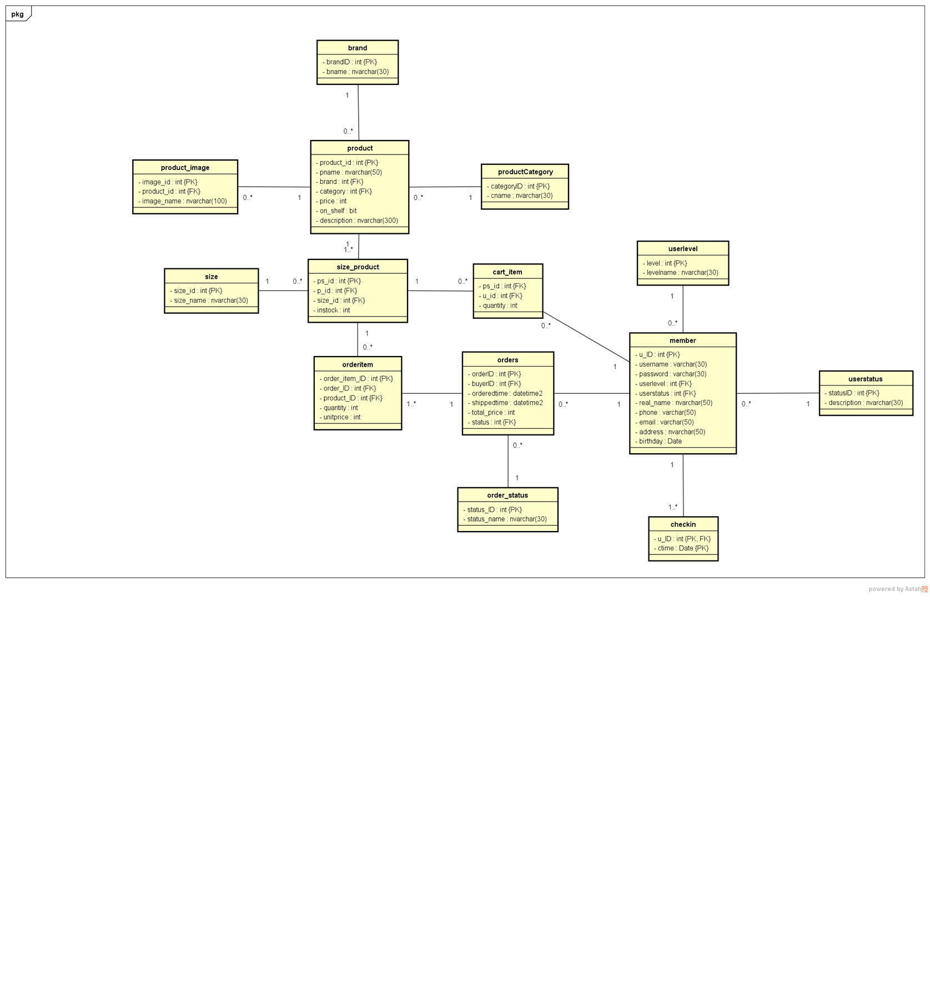
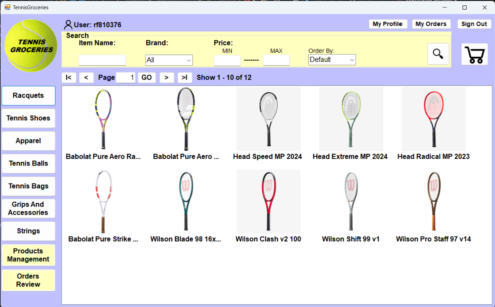

# project_personal
A simple version sports goods selling system

## Features
- User registration and login
- Product listing, filtering, and sorting
- Product details page
- Shopping cart functionality
- Order management

---

## **Technologies Used**
- **Programming Language**: C#.
- **Framework**: Windows Form App (.NET Framework) / ADO.NET.
- **Development Environment**: Visual Studio 2022.
- **DATABASE**: Microsoft SQL Server / SQL Server Management System 20.

---
## Installation and Setup
1. Clone this project：
   ```bash
   git clone https://github.com/Andy830203/project_personal.git
2. Open and run project_personal.sln

---

## Database Structure


## Screenshots


